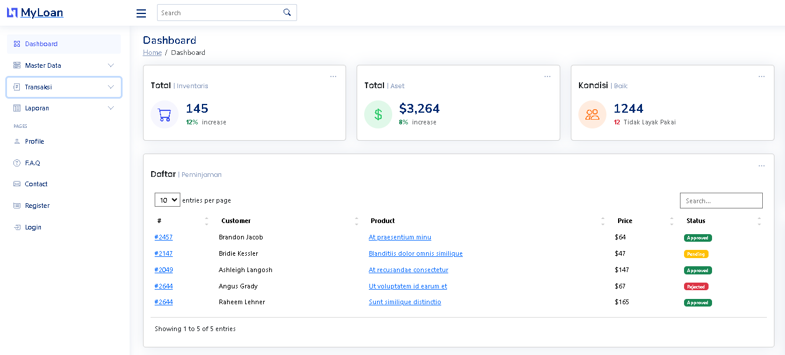

# MyLoan - Inventory



Sebuah pengembangan proyek dengan framework laravel dan mysql, isi yang didapatkan
diantaranya terdapat dashboard admin beserta grafik chart berdasarkan data, selain itu tersedia fitur Export PDF, Scan QR Barcode.

## Instalasi

1. **Clone Repositori:**

   ```bash
   git clone https://github.com/iKhsan-farabi/MyLoan.git

2. **Masuk Direktori Clone:**

   ```bash
   cd myLoan

3. **Instal Dependensi yang dibutuhkan:**

   ```bash
   composer install

4. **Copy Database**

   ```bash
   cp .env.example .env

5. **Generate key**

   ```bash
   php artisan key:generate

6. **Migrate**

   ```bash
   php artisan migrate --seed

# Role Akun

**username :**
- Admin : livia@asia.com
- Pimpinan : aina@asia.com
- Operator : dinda@asia.com      

**password :**
bismillah0
